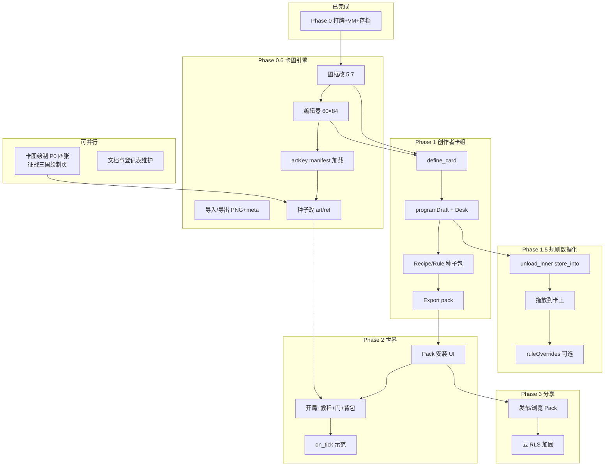

# Card World — 完整规划步骤

**版本：** 2026-07-02  
**性质：** 总览性路线图（不写代码；实施时以各专题文档为准）

本文把 **卡图对齐征战三国**、**创作者卡组**、**元规则数据化**、**世界内容与分享** 串成一条可执行的步骤链。细节见文末文档索引。

---

## 一、北极星（玩家最终得到什么）

```text
一张桌（场 + 手牌）
  → 打牌即玩法（拖/双击）
  → 用卡画面、做音乐（创作工具卡）
  → 用卡定义新卡、写程序、改规则（创作者卡组）
  → 打包分享，别人一键安装（无早期经济）
```

**一句话：** 万物皆卡；Founder 用**卡牌**编程自己的世界，而不是改 JS。

---

## 二、今天已经有什么（Phase 0 / 0.5 ✓）

| 能力 | 状态 |
|------|------|
| 场 + 手牌、拖放、双击打出/收回 | ✓ |
| VM `on_play`（spawn/deal/scene/高亮/语言…） | ✓ |
| 存档 / 读档、中英 locale | ✓ |
| 设置容器菜单、Shop Script 引导 | ✓ |
| 像素画板、作品库、可选素材店上传 | ✓ |
| HarmonyForge 音乐嵌入 | ✓ |
| 场景栈（Computer 桌面已有，缺入口卡） | 半完成 |
| 离线 + Service Worker | ✓ |

---

## 三、三大断层（必须先认清）

### 断层 A — 卡图

- 卡壳 5:7，但**图框是 7:5 横图**；编辑器 35×25；种子全是 **8×8 占位**。
- [征战三国](https://github.com/jk9988610/Conquer-the-Three-Kingdoms) 已定标准：**60×84 展示 / 500×700 逻辑 / 5:7 / PNG + manifest**。
- → 见 **CARD-ART.md**、**ART-REGISTRY.md**

### 断层 B — 造物（Creator Deck）

- 玩家不能局内 `define_card`、不能 Program Desk 组程序、不能绑规则。
- Play / 容器 / playStyle 写在 `app.js`，不是数据。
- → 见 **CREATOR-DECK.md**

### 断层 C — 世界与分发

- 开局几乎是空桌；Pack JSON 在仓库里但**无安装 UI**；门/背包/Computer 入口未接进 starter。
- → 见 **ROADMAP.md** Phase 2–3

---

## 四、总依赖关系



**关键顺序：**

1. **卡图 P0 绘制**可与引擎并行（不阻塞开发）。
2. **Phase 0.6 至少完成 0.6.2（5:7 图框）** 再开 Creator Deck 的「画卡面」。
3. **Creator Deck 最小闭环（1.1–1.4）** 再做规则数据化与世界内容。
4. **Pack 安装 UI** 是玩家分享与官方内容落地的闸门。

---

## 五、分步实施（完整步骤）

### 阶段 0 — 文档基线 ✓

| 步 | 内容 | 产出 | 状态 |
|----|------|------|------|
| 0.1 | 删除误入的 Piano 规格；对齐 README/DEMO | 文档与实现一致 | ✓ |
| 0.2 | 创作者卡组规格 | CREATOR-DECK.md | ✓ |
| 0.3 | 卡图对齐征战三国 | CARD-ART.md | ✓ |
| 0.4 | artKey 登记表 | ART-REGISTRY.md + seed/art-registry.json | ✓ |
| 0.5 | 分阶段路线图 | ROADMAP.md | ✓ |

---

### 阶段 0.5-内容 — 卡图绘制（**现在就能做，无需改 Card World 代码**）

在 [征战三国绘制页](https://jk9988610.github.io/Conquer-the-Three-Kingdoms/) 完成 **P0 四张**：

| 步 | artKey | 对应 slug | 完成后 |
|----|--------|-----------|--------|
| 0.5.1 | `settings` | founders.settings | 上传 card-art，`art-registry` → ready |
| 0.5.2 | `pixel-board` | art.tool.pixel | 同上 |
| 0.5.3 | `music-studio` | music.tool.studio | 同上 |
| 0.5.4 | `door` | content.door | 同上 |

然后按 **ART-REGISTRY.md** P1/P2 优先级补：语言菜单、全屏、高亮、返回等。

**验收：** Supabase `card-art` 上可见对应 PNG；登记表 `status: ready`。

---

### 阶段 0.6 — 卡图引擎对齐

| 步 | 任务 | 依赖 | 验收 |
|----|------|------|------|
| 0.6.1 | CSS：`--card-image-ratio` **7:5 → 5:7** | — | 卡面图区竖向 5:7，无拉伸 |
| 0.6.2 | 画板默认网格 **60×84**；支持透明底 | 0.6.1 | 与征战三国块面一致 |
| 0.6.3 | `image.type: art/ref` + `artKey`；拉 manifest；IndexedDB 缓存 | 0.6.1 | 填 `artKey: lvbu` 能显示 |
| 0.6.4 | 图片导入：裁切 5:7 + 下采样（移植 CTTK `imageToGrid` 思路） | 0.6.2 | 照片→卡图可用 |
| 0.6.5 | 导出 PNG + 可选 meta.json | 0.6.2 | 与征战三国资源包互认 |
| 0.6.6 | 官方种子：`pixel/v1` 8×8 → `art/ref`（按登记表） | 0.6.3 + P0 绘制 | validate-seed 通过 |
| 0.6.7 | `validate-seed`：slug 必须在 art-registry 登记 | 0.6.6 | CI 拦截漏登记 |

---

### 阶段 1 — 创作者卡组（造卡 + 写程序）

**目标循环：** `Program Desk 编辑 → Test → Attach → Save World`

| 步 | 任务 | 依赖 | 验收 |
|----|------|------|------|
| 1.1 | VM：`define_card`；`state.customDefinitions[]` 写入存档 | 0.6.2 | 局内新建卡，reload 仍在 |
| 1.2 | `state.programDraft`；编译 programId；Attach 到 `programs.on_play` | 1.1 | 绑程序后打出生效 |
| 1.3 | Program Desk 最小 UI：节点列表 + Test + Attach | 1.2 | 不用写 JSON 文件 |
| 1.4 | 种子：`founders.creator_deck` 容器 + 内层工具卡 | 1.3 | 开局或 deal 可得 |
| 1.5 | Recipe kit：每张卡对应一个 IR op（reusable） | 1.3 | 用卡拼出 spawn 链 |
| 1.6 | 教程卡 + Shop Script 引导 Creator 路径 | 1.4 | 高亮逐步走完 |
| 1.7 | Export：下载 pack JSON（defs + programs + images） | 1.1 | 文件可被 validate-seed 吃 |
| 1.8 | Define Card 画卡面走 0.6 规格 | 0.6.2 + 1.1 | 玩家造的卡是 60×84 |

**本阶段刻意不做：** 可视化图编排、`on_tick`、拖放到卡上。

---

### 阶段 1.5 — 元规则数据化（让玩家能「设计规则」）

| 步 | 任务 | 依赖 | 验收 |
|----|------|------|------|
| 1.5.1 | IR：`unload_inner`、`store_into`；去掉等效硬编码分支 | 1.2 | 容器行为可由程序描述 |
| 1.5.2 | 拖放目标：卡面而不仅是 zone | 1.5.1 | 物品可 store 进指定背包 |
| 1.5.3 | Rule kit 卡：Play 样式、On Play / On Store 附着 | 1.4 | 用卡改 reusable/echo 等 |
| 1.5.4 | （可选）`state.ruleOverrides` + Rules 文档卡 | 1.5.3 | 规则变更有版本 imprint |

**验收：** 不用改 `app.js` 即可用新容器模板 + 规则卡做出「自定义背包」示范。

---

### 阶段 2 — 有内容的世界

| 步 | 任务 | 依赖 | 验收 |
|----|------|------|------|
| 2.1 | Pack 列表 + Install（合并 defs/programs） | 1.7 或官方 pack | UI 安装 official.computer |
| 2.2 | `founders.computer` 入口卡 → `computer.enter` | 2.1 | 从世界进桌面 |
| 2.3 | `seed.starter_deck` 背包卡（container+deck） | 1.5.1 | 收纳场面物品 |
| 2.4 | 重做出开局：教程 + Creator Deck + 门 + Shop Script | 1.4 + 0.6.6 | 新人 5 分钟内走完一课 |
| 2.5 | VM：`on_tick` + `if` / `tick_mod_n`；跑通 flagship | 2.1 | 场上自动刷 Note |
| 2.6 | 三国主题内容包：复用征战三国 artKey（liu/guan…） | 0.6.3 + 2.1 | 安装即玩角色卡 |

---

### 阶段 3 — 分享（仍无经济）

| 步 | 任务 | 依赖 | 验收 |
|----|------|------|------|
| 3.1 | 发布 Pack 到云（slug、version、manifest） | 2.1 | 上传后生成可安装 URL |
| 3.2 | 浏览远程 Pack + 一键安装 | 3.1 | 第二玩家离线可玩已装包 |
| 3.3 | Supabase RLS 改为需登录（替换全开策略） | 3.1 | 见 SUPABASE_ART.md |
| 3.4 | 卡图正式库 `card-art` 与玩家店 `art` 职责分离 | 0.6.3 | 官方/UGC 不混桶 |

---

### 阶段 4+ — 以后

| 方向 | 说明 |
|------|------|
| 响应链 | 「A 打出后 B 可响应」 |
| Program Desk 图编排 | 分支、合并，仍保持打牌交互 |
| Rules 卡生态 | 社区发布规则包 |
| 可选打赏 | 架构上预留，产品上不优先 |
| 实时多人同桌 | 明确不做 |

---

## 六、三条工作线（谁做什么）

| 工作线 | 负责人倾向 | 产出物 | 阶段 |
|--------|------------|--------|------|
| **美术线** | 人 / AI | 征战三国绘制 → card-art PNG；更新 art-registry | 0.5-内容 → 持续 |
| **引擎线** | 开发 | app.js VM/CSS/画板/manifest/Creator Deck | 0.6 → 1 → 1.5 |
| **内容线** | 设计 / AI | seed JSON、programs、packs、locales、教程文案 | 1.4 起 → 2 |
| **基建线** | 开发 | validate-seed、CI、云策略、文档 | 全程 |

**并行建议：**

- 引擎做 0.6.1–0.6.3 时，美术同步画 P0 四张。
- Creator Deck 种子（1.4–1.6）可由 AI 批量写 JSON，等人审。
- 三国角色卡内容（2.6）在 artKey 已 ready 后几乎是零美术成本。

---

## 七、各阶段完成标志（里程碑）

| 里程碑 | 标志 | 玩家体感 |
|--------|------|----------|
| **M1 能看** | 0.6.1–0.6.3 + P0 四图 ready | 官方卡不再是色块 |
| **M2 能画** | 0.6 全部 | 画板与征战三国一致；可导入照片 |
| **M3 能造** | Phase 1 全部 | 自己造卡、写 on_play、存盘 |
| **M4 能配规则** | Phase 1.5 | 容器与样式用 Rule kit 配 |
| **M5 能玩世界** | Phase 2 全部 | 教程关 + 背包 + Computer + 示范游戏 |
| **M6 能分享** | Phase 3 | 发 Pack、别人安装 |

---

## 八、AI 友好工作清单（少改引擎、多产数据）

适合 AI 批量生成、人审后合入：

1. **art-registry** 新行 + 征战三国绘制说明（notes 列）
2. **definitions.json** 新卡（先 `art/ref` 或占位）
3. **programs/*.json** IR 程序
4. **starter-world.json** 变体开局
5. **locales** 中英文案
6. **packs/*.json** 可安装内容包
7. **Recipe / Rule** 创作者卡组内的编程卡定义

不适合 AI 独自完成（需工程）：

- `app.js` 拖放状态机核心改造
- manifest 缓存与 art/ref 加载器
- Program Desk 会话状态
- Pack Install 合并逻辑

---

## 九、明确不做

- Piano Studio 产品线（属其他仓库）
- 早期氪金 / 审批 / 战力
- 实时多人同步桌
- 在 Card World 里重写征战三国战斗规则（战斗留在 CTTK；Card World 只复用卡图与 Pack 思路）

---

## 十、文档索引

| 文档 | 何时读 |
|------|--------|
| **PLAN.md**（本文） | 看全局步骤与依赖 |
| [ARCHITECTURE.md](ARCHITECTURE.md) | 原则与阶段概览 |
| [ROADMAP.md](ROADMAP.md) | 英文精简里程碑表 |
| [CARD-ART.md](CARD-ART.md) | 卡图规格与格式 |
| [ART-REGISTRY.md](ART-REGISTRY.md) | artKey ↔ slug 登记 |
| [CREATOR-DECK.md](CREATOR-DECK.md) | 创作者卡组设计 |
| [RULES.md](RULES.md) | 已实现 / 未实现规则 |
| [DEMO.md](DEMO.md) | 当前版本能玩什么 |
| [OFFLINE.md](OFFLINE.md) | 离线策略 |
| [SUPABASE_ART.md](SUPABASE_ART.md) | 云桶与 SQL |

征战三国侧：[art-assets.md](https://github.com/jk9988610/Conquer-the-Three-Kingdoms/blob/main/docs/art-assets.md)

---

## 十一、建议的「下一步」动作（仍不写 Card World 引擎时）

1. **美术：** 按 ART-REGISTRY P0 画四张并上传 card-art。  
2. **产品：** 审阅 Creator Deck 内层卡片清单是否还要增减。  
3. **开发（何时开工）：** 从 **0.6.1 图框 5:7** 切第一个 PR。  

引擎第一个 PR 建议范围：仅 CSS 图框 + 画板尺寸，不碰 Creator Deck。
